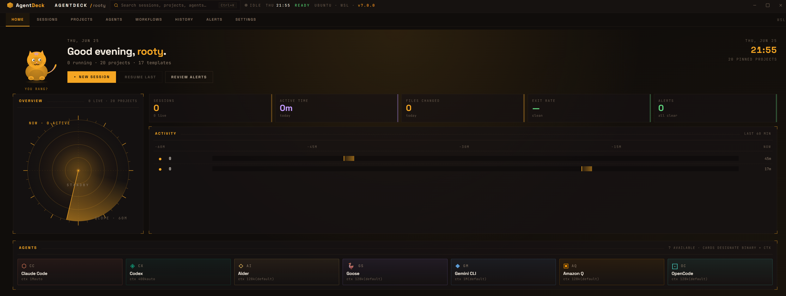
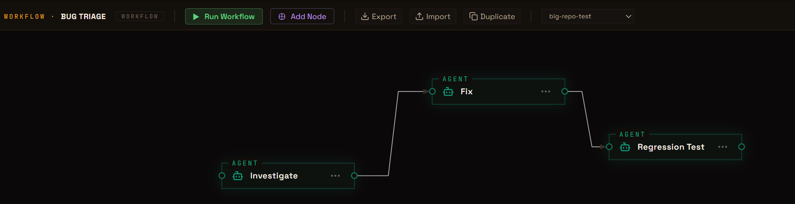

# AgentDeck

A desktop terminal manager for WSL AI coding agents. Launch, manage, and orchestrate sessions across multiple agents from a single interface.


## Why AgentDeck?

If you work with AI coding agents, you know the pain: each agent is its own CLI, its own terminal tab, its own workflow. Switching between Claude Code, Codex, Aider, and others means juggling windows, re-typing project paths, and losing context.

AgentDeck puts all your agents in one place. Open a project, pick an agent, and you're coding. Split the screen to run two agents side-by-side. Chain agents into automated workflows with conditions, loops, and variables. Keep your prompt templates, project configs, and session history organized instead of scattered across terminals.

It's a desktop app, not a web service — your code stays local, your API keys are encrypted at rest, and everything runs through your own WSL environment.

<p align="center">
  
  <br/>
  <sub><em>Home tab — scope viz, daily digest, live activity, agent grid, and 7-day cost.</em></sub>
</p>

## Overview

AgentDeck provides a unified desktop environment for working with AI coding agents through WSL terminals:

- **Multi-Agent Support** - 7 agents: Claude Code, Codex, Aider, Goose, Gemini CLI, Amazon Q, OpenCode
- **Project Management** - Configure projects with paths, agents, prompt templates, and stack badges
- **Split Terminal Views** - 1/2/3 pane layouts with independent sessions
- **Agentic Workflows** - Visual node-graph editor with conditions, loops, variables, and execution history
- **Cost/Token Tracking** - Live per-session cost and token usage for Claude Code and Codex
- **Git Worktree Isolation** - Per-session git branches with Keep/Discard review flow
- **3 Themes** - Tungsten (warm amber), Phosphor (retro CRT green), Dusk (violet/coral) — smooth view transitions, Space Grotesk display type
- **Home Screen Dashboard** - Scope viz, KPI strip, activity graph, live session monitoring, cost dashboard, project cards, optional "Pixel" mascot
- **Top Tab Bar Navigation** - 8 tabs (Home / Sessions / Projects / Agents / Workflows / History / Alerts / Settings) with `Alt+1..8` jump shortcuts
- **Command Palette** - Quick access to projects, sessions, templates, and tools

## Features

### Terminal Sessions

- **Split View** - Up to 3 terminal panes side-by-side with draggable dividers
- **Bare Terminals** - Open plain WSL shells without a project (Ctrl+T)
- **Terminal Caching** - Sessions persist across tab switches without re-rendering
- **Terminal Search** - Find text in terminal output (Ctrl+Shift+F) with regex and case-sensitive modes
- **Activity Tracking** - Real-time parsing of agent tool use (file reads, writes, commands)
- **Right Panel** - 5 tabs per session: Files (project / worktree filesystem tree), Diff (staged-vs-working with Keep / Discard), Prompts (template inspector with Inject →), Env (per-agent hooks / skills / MCP / config snapshot), Config (session settings)
- **New Session Composer** - Dedicated screen to pick agent, drop in a prompt, set branch mode, and launch — the prompt is piped into the agent's stdin after spawn

### Home Screen Dashboard

- **Daily Digest** — today's session count, cost, exit rate, top agent
- **Live Session Grid** — real-time agent monitoring with activity pulse, token gauge
- **Session Timeline** — horizontal activity bars per session
- **Cost Dashboard** — daily cost with per-agent breakdown, 7-day sparkline
- **Project Cards** — git status (branch, uncommitted changes), agent pills
- **Suggestions Panel** — proactive recommendations based on project state
- **Quick Actions** — New Session, Run Workflow, From Template, Resume Last

### Project Management

- **New Project Wizard** - 5-step setup with folder picker and agent configuration
- **Multi-Agent Projects** - Assign multiple agents per project, launch with any via context menu
- **Stack Detection** - Auto-detect project stack (React, Python, Rust, etc.) from files
- **Pinned Projects** - Pin favorites to the home screen grid
- **Project Settings** - 6-tab settings panel for path, agent, templates, and more

### Prompt Templates

- **16 Seed Templates** - Ready-to-use templates across 8 categories
- **Template Editor** - Create and edit templates with live preview
- **Template Attach** - Inject template content into the active session from the Prompts tab in the right panel
- **Categories** - Code Review, Debugging, Documentation, Planning, Refactoring, Security, Testing, General

### Agentic Workflows

- **Visual Node Graph** - Drag-and-drop editor for agent, shell, checkpoint, and condition nodes
- **Edge-Activation Scheduler** - Ready-queue execution with branching, skip propagation, and loop support
- **Conditional Branching** - Route execution based on exit codes or output pattern matching
- **Loop/Retry** - Loop-back edges with max iterations, per-node retry with configurable delay
- **Variables** - `{{VAR}}` substitution with typed pre-run dialog (string, text, path, choice)
- **Roles** - 8 seed roles (Architect, Reviewer, etc.) with persona injection
- **Checkpoints** - Pause/resume execution at designated points
- **Import/Export** - Share workflows as `.agentdeck-workflow.json` bundles with role remapping
- **Execution History** - Per-run summaries with node timing, error tails, and a History tab

<p align="center">
  
  <br/>
  <sub><em>Workflow editor — agent-coloured nodes, step-elbow edges, React Flow under the hood.</em></sub>
</p>

### Command Palette

- **Quick Launch** - Open projects, switch sessions, run templates (Ctrl+K / Escape)
- **Theme Switcher** - Live-preview themes before applying
- **Agent Visibility** - Toggle which agents appear on the home screen
- **Keyboard Shortcuts** - Full shortcut reference (Ctrl+/)

### Cost/Token Tracking

- **Live Cost Badge** - Per-session USD cost and token count in the session header
- **Claude Code Support** - Parses JSONL session logs with cache-aware pricing (write 1.25x, read 0.1x)
- **Codex CLI Support** - Parses JSONL rollout logs with per-model pricing maps
- **Tooltip Breakdown** - Hover for input, output, cache read, and cache write token counts
- **Automatic Discovery** - Finds active log files via WSL polling, no configuration needed

### Git Worktree Isolation

- **Per-Session Branches** - Each agent session gets its own git worktree and branch
- **Branch Badge** - Active branch shown in the session header
- **Review Flow** - Inspect changes on close, then Keep (merge) / Discard / Cancel
- **Automatic Cleanup** - Orphaned worktrees pruned on startup

### Agent Updates

- **Version Checking** - Startup notification when agent updates are available
- **One-Click Update** - Update agents directly from the home screen (resolves exact version from registry)
- **Automatic Detection** - Discovers installed agents via WSL PATH

### Theming

| Theme | Vibe |
|-------|------|
| **Tungsten** (default) | Sodium amber on warm charcoal |
| **Phosphor** | Retro CRT green on ink |
| **Dusk** | Violet + coral on plum-black |

All themes use CSS custom properties from `tokens.css`. Per-agent accent tokens (`--agent-claude`, `--agent-codex`, …) keep each agent's signature color consistent across themes. View transitions provide smooth theme switching with a circular reveal effect, and v5.x users' retired palettes are auto-migrated to the nearest successor on first boot.

## Keyboard Shortcuts

| Shortcut | Action |
|----------|--------|
| Ctrl+K | Command Palette |
| Escape | Command Palette (from session) |
| Ctrl+N | New Project |
| Ctrl+T | New Terminal |
| Ctrl+\\ | Toggle Right Panel |
| Ctrl+/ | Keyboard Shortcuts |
| Ctrl+1/2/3 | Pane Layout |
| Ctrl++/- | Zoom In/Out |
| Ctrl+0 | Reset Zoom |
| Ctrl+Shift+F | Search in Terminal |
| Ctrl+S | Save Template |

## Installation

### Prerequisites
- Windows 10/11 with WSL2 (Ubuntu recommended)
- Node.js 22.22.1 or later (see `.nvmrc`; required by `lint-staged` 17)
- At least one AI coding agent installed in WSL

### Setup

```bash
# Install dependencies (--no-bin-links required on Windows-mounted drives)
npm install --no-bin-links
```

## Development

```bash
# Start development server with hot reload
npm run dev

# Build for production (validates TypeScript)
npm run build

# Run tests (1229 tests)
npm test

# Lint code (zero-warning policy)
npm run lint

# Format code
npm run format
```

## Building for Distribution

```bash
# Quick build (no pre-flight checks)
npm run dist

# Gated release build — lint, typecheck, tests, clean, then build + verify
npm run release-portable
```

Output: `dist/AgentDeck-{version}-portable.exe` (~93 MB)

## Project Structure

```
src/
├── main/                                  # Electron main process (Node.js)
│   ├── index.ts                           # App lifecycle, BrowserWindow, IPC wiring
│   ├── ipc/                               # 14 IPC modules: pty, window, agents,
│   │                                      # projects, workflows, skills, worktree,
│   │                                      # cost, home, templates, env, files, utils
│   ├── pty-manager.ts / pty-bus.ts        # node-pty spawn/resize/kill + event routing
│   ├── workflow-engine.ts                 # Edge-activation scheduler DAG execution
│   ├── edge-scheduler.ts                  # Pure scheduler — ready queue, branching, loops
│   ├── node-runners.ts                    # runAgentNode / runShellNode CLI invocation
│   ├── variable-substitution.ts           # {{VAR}} replacement in workflow nodes
│   ├── workflow-store.ts                  # Workflow CRUD with atomic writes
│   ├── workflow-run-store.ts              # Per-run execution history
│   ├── workflow-history.ts                # Run summaries + error tails
│   ├── workflow-seeds.ts                  # Built-in workflow blueprints
│   ├── project-store.ts                   # electron-store: projects + roles + appPrefs
│   │                                      # (safeStorage for API keys; versioned migrations)
│   ├── store-seeds.ts                     # Seed templates and roles
│   ├── template-{store,legacy-store,
│   │            migration,id}.ts          # Disk-backed template store + legacy compat shim
│   ├── log-adapters.ts                    # Per-agent JSONL parsers (Claude + Codex)
│   ├── cost-tracker.ts                    # Log discovery, tailing, IPC push
│   ├── cost-history.ts                    # Daily cost rollups (versioned disk cache)
│   ├── git-port.ts / git-status.ts        # Git over WSL + per-project state cache
│   ├── worktree-manager.ts                # Per-session git worktree lifecycle
│   ├── review-tracker.ts                  # Unreviewed commit tracking
│   ├── agent-detector.ts                  # Agent binary discovery via WSL PATH
│   ├── agent-updater.ts                   # Version check + npm update with rollback
│   ├── agent-env-*.ts                     # Per-agent config-snapshot resolvers
│   ├── active-model-detectors/            # Per-agent active-model detection (7 detectors)
│   ├── skill-scanner.ts                   # Codex skill discovery
│   ├── detect-stack.ts                    # Project stack detection
│   ├── files-{lister,gitignore}.ts        # File-browser support for the Files tab
│   ├── wsl-exec.ts                        # wslRun / wslTry — single helper for
│   │                                      # `wsl.exe -- bash -lc <cmd>` invocations
│   ├── wsl-paths.ts / wsl-utils.ts        # Path resolution, distro detection, UNC fallback
│   ├── validation.ts                      # Re-exports SAFE_ID_RE / validateId from shared
│   ├── fs-atomic.ts                       # Atomic write-then-rename
│   └── logger.ts                          # Levelled file logger
├── preload/
│   └── index.ts                           # contextBridge → window.agentDeck (~65 channels)
├── renderer/                              # React app (electron-vite)
│   ├── main.tsx / App.tsx                 # React root, view routing, global keymap
│   ├── components/                        # Titlebar, TopTabBar, SessionTabs, SessionHeader,
│   │                                      # SplitView, Terminal, RightPanel, HomeScreen,
│   │                                      # CommandPalette, NotificationToast, ...
│   ├── screens/                           # WorkflowEditor, NewSessionScreen,
│   │                                      # DiffReviewScreen, plus per-tab screens
│   │                                      # (Sessions/Projects/Agents/Workflows/...)
│   ├── store/
│   │   ├── appStore.ts                    # Zustand root composing 7 slices
│   │   └── slices/                        # sessions, ui, projects, workflows,
│   │                                      # templates, notifications, home
│   ├── selectors/                         # Cross-slice computed selectors
│   ├── hooks/                             # useProjects, usePty, useRolesMap,
│   │                                      # useSessionTimeline, useCostHistory, ...
│   ├── utils/                             # agent-ui, themeObserver, pty-write, ipcErrorHandler
│   └── styles/                            # tokens.css (design system), global.css, themes
└── shared/                                # Shared across main / preload / renderer
    │                                      # (no Node-only or renderer-only deps)
    ├── agents.ts                          # Canonical 7-agent registry — single source for
    │                                      # CLI flags, color, mnemonic, supportsSkills,
    │                                      # plus derived AGENT_*_MAP exports
    ├── agent-helpers.ts                   # Agent utility functions
    ├── types.ts                           # Domain types (Session, Workflow, Project, ...)
    ├── workflow-utils.ts                  # validateWorkflow + topoSort
    ├── validation.ts                      # SAFE_ID_RE + validateId
    ├── themes.ts                          # THEME_IDS + THEME_STARTUP_BG (synced with tokens.css)
    ├── constants.ts                       # Named constants (caps, intervals, timeouts)
    ├── context-{types,window}.ts          # Effective-context resolution types + helpers
    ├── models.ts / model-heuristic.ts /
    │   model-id-normalize.ts              # Per-CLI model lists, context-window heuristics
    ├── ansi.ts                            # ANSI escape stripping
    ├── approval-transitions.ts            # Session approval-state machine
    └── date-keys.ts                       # Local-time date keying for cost rollups
```

`WorkflowNode` is a discriminated union — `AgentNode | ShellNode | CheckpointNode | ConditionNode` — so the engine dispatch and validator are exhaustive at compile time. Every IPC handler that accepts a caller-supplied identifier validates through `shared/validation.validateId`. New themes, agents, and workflow node types are added by extending their respective registries; consumers read derived maps and the type system surfaces missed updates.

## Tech Stack

| Technology | Purpose |
|------------|---------|
| [Electron 42](https://electronjs.org) | Desktop application shell |
| [React 19](https://react.dev) | UI framework |
| [TypeScript 6](https://typescriptlang.org) | Type-safe development (strict mode) |
| [electron-vite 5](https://electron-vite.org) | Build tooling |
| [xterm.js 5](https://xtermjs.org) | Terminal emulator |
| [node-pty](https://github.com/microsoft/node-pty) | Pseudo-terminal (WSL sessions) |
| [Zustand](https://zustand-demo.pmnd.rs) | State management |
| [React Flow](https://reactflow.dev) | Visual workflow node editor |
| [Vitest 4](https://vitest.dev) | Testing framework (1229 tests) |
| [ESLint 9](https://eslint.org) | Linting (flat config, zero-warning policy) |

## Documentation

- **[User Guide](./docs/USER-GUIDE.md)** - Detailed usage instructions
- **[Changelog](./CHANGELOG.md)** - Version history and release notes
- **[Contributing](./CONTRIBUTING.md)** - How to contribute
- **[Security](./SECURITY.md)** - Reporting vulnerabilities

## License

[Elastic License 2.0](./LICENSE) — free to use, modify, and share. You may not offer it as a hosted/managed service.

## Support

- Star this repository
- [Report issues](../../issues) or suggest features
